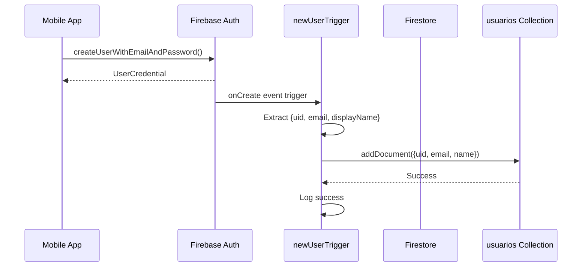
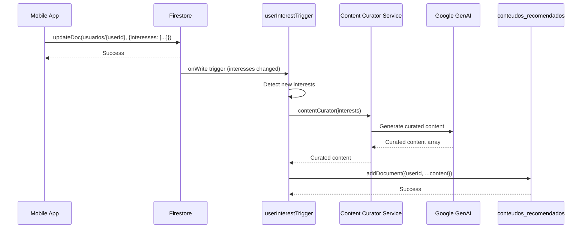
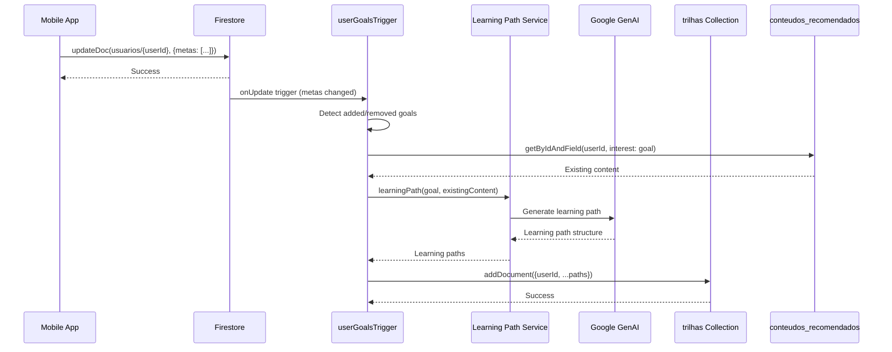
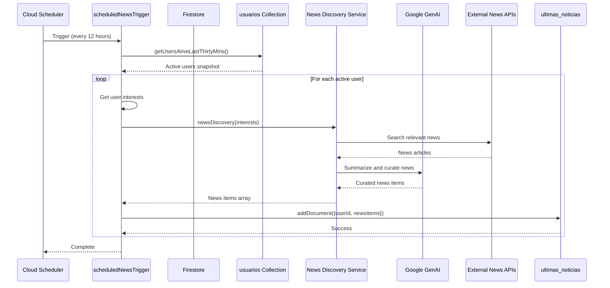

# Diagrama de Arquitetura - InFlow System

Este documento apresenta a arquitetura completa do sistema InFlow, incluindo o aplicativo mobile e o serviço backend.
graph TB
    subgraph "Mobile App (React Native + Expo)"
        APP[InFlow Mobile App]
        AUTH[AuthProvider/useAuth]
        SCREENS[Telas do App]
        SERVICES[Services Layer]
    end
    
    subgraph "Firebase Services"
        FBAUTH[Firebase Authentication]
        FS[Firestore Database]
        FBAUTH -->|onCreate Event| CF1
    end
    
    subgraph "Cloud Functions (Backend Service)"
        CF1[newUserTrigger<br/>onUserCreate]
        CF2[userInterestTrigger<br/>onUserInterestChange]
        CF3[userGoalsTrigger<br/>onUserGoalsChange]
        CF4[scheduledNewsTrigger<br/>Scheduled Execution]
    end
    
    subgraph "AI Services (GenAI)"
        AI1[Content Curator Service]
        AI2[Learning Path Service]
        AI3[News Discovery Service]
        GENAI[Google GenAI Client]
    end
    
    subgraph "External Services"
        NEWS[News APIs]
    end
    
    subgraph "Firestore Collections"
        COL1[(usuarios)]
        COL2[(conteudos_recomendados)]
        COL3[(trilhas)]
        COL4[(ultimas_noticias)]
        COL5[(usuario_progresso)]
        COL6[(usuario_bookmarks)]
    end
    
    subgraph "Scheduler"
        SCHED[Cloud Scheduler<br/>Every 12 hours]
    end
    
    %% Mobile App Connections
    APP --> AUTH
    APP --> SCREENS
    SCREENS --> SERVICES
    SERVICES --> FBAUTH
    SERVICES --> FS
    
    %% Firebase Auth Trigger
    FBAUTH -.->|Triggers| CF1
    
    %% Firestore Triggers
    FS -.->|onWrite usuarios/{userId}<br/>interesses changed| CF2
    FS -.->|onUpdate usuarios/{userId}<br/>metas changed| CF3
    
    %% Cloud Functions to AI Services
    CF1 --> COL1
    CF2 --> AI1
    CF3 --> AI2
    CF4 --> AI3
    
    %% AI Services to GenAI
    AI1 --> GENAI
    AI2 --> GENAI
    AI3 --> GENAI
    
    %% AI Services to Firestore
    AI1 --> COL2
    AI2 --> COL3
    AI3 --> COL4
    
    %% Scheduler to Cloud Function
    SCHED -->|Triggers| CF4
    CF4 --> FS
    
    %% Firestore Collections
    FS --> COL1
    FS --> COL2
    FS --> COL3
    FS --> COL4
    FS --> COL5
    FS --> COL6
    
    %% External Services
    AI3 --> NEWS
    
    %% Styling
    classDef mobileApp fill:#4A90E2,stroke:#2E5C8A,color:#fff
    classDef firebase fill:#FFA000,stroke:#F57C00,color:#fff
    classDef cloudFunction fill:#34A853,stroke:#2E7D32,color:#fff
    classDef aiService fill:#9C27B0,stroke:#7B1FA2,color:#fff
    classDef firestore fill:#FF6F00,stroke:#E65100,color:#fff
    classDef scheduler fill:#00BCD4,stroke:#0097A7,color:#fff
    
    class APP,AUTH,SCREENS,SERVICES mobileApp
    class FBAUTH firebase
    class CF1,CF2,CF3,CF4 cloudFunction
    class AI1,AI2,AI3,GENAI aiService
    class COL1,COL2,COL3,COL4,COL5,COL6,FS firestore
    class SCHED scheduler
```

## Fluxo de Dados Detalhado

### 1. Criação de Usuário



### 2. Atualização de Interesses



### 3. Atualização de Metas



### 4. Descoberta de Notícias Agendada



## Componentes do Sistema

### Mobile App (app--mobile-inflow)

**Tecnologias:**
- React Native + Expo
- TypeScript
- Expo Router (navegação baseada em arquivos)
- Firebase SDK (Auth, Firestore)
- React Context API (gerenciamento de estado)

**Principais Módulos:**
- `app/`: Estrutura de rotas e telas
- `src/hooks/`: Hooks customizados (useAuth, useCourses, etc.)
- `src/services/`: Serviços de integração (auth.ts, firebase.ts)
- `src/components/`: Componentes reutilizáveis

### Backend Service (service--app-mobile-inflow)

**Tecnologias:**
- Firebase Cloud Functions (v1)
- TypeScript
- Google GenAI (IA para geração de conteúdo)
- Firestore Admin SDK

**Cloud Functions:**

1. **newUserTrigger** (`onUserCreate`)
   - **Trigger**: Firebase Auth `onCreate`
   - **Função**: Cria perfil básico do usuário no Firestore
   - **Output**: Documento em `usuarios` collection

2. **userInterestTrigger** (`onUserInterestChange`)
   - **Trigger**: Firestore `onWrite` em `usuarios/{userId}`
   - **Função**: Detecta novos interesses e gera curadoria de conteúdo
   - **Output**: Documentos em `conteudos_recomendados`

3. **userGoalsTrigger** (`onUserGoalsChange`)
   - **Trigger**: Firestore `onUpdate` em `usuarios/{userId}`
   - **Função**: Gera trilhas de aprendizado baseadas em metas
   - **Output**: Documentos em `trilhas`

4. **scheduledNewsTrigger** (`scheduledNewsDiscovery`)
   - **Trigger**: Cloud Scheduler (a cada 12 horas)
   - **Função**: Busca notícias relevantes para usuários ativos
   - **Output**: Documentos em `ultimas_noticias`

**AI Services:**
- `contentCuratorService`: Gera recomendações de conteúdo
- `learningPathService`: Cria trilhas de aprendizado estruturadas
- `newsDiscoveryService`: Descobre e resume notícias relevantes

### Firestore Collections

1. **usuarios**: Perfis de usuários
   - `uid`, `email`, `name`
   - `interesses[]`, `metas[]`
   - `level`, `xp`, `currentStreak`, etc.

2. **conteudos_recomendados**: Conteúdos curados por IA
   - `userId`
   - `title`, `url`, `type`, `category`, etc.

3. **trilhas**: Trilhas de aprendizado
   - `userId`, `meta`
   - `title`, `description`, `steps[]`, etc.

4. **ultimas_noticias**: Notícias descobertas
   - `userId`
   - `newsItems[]` com notícias resumidas

5. **usuario_progresso**: Progresso do usuário
   - `userId`, `contentId`
   - `progressPercentage`, `completed`, etc.

6. **usuario_bookmarks**: Bookmarks do usuário
   - `userId`, `articleId`
   - `createdAt`

## Fluxo de Comunicação

### Requisições Síncronas (Mobile → Firebase)
- Autenticação (login, signup, logout)
- Leitura de dados (perfil, conteúdos, trilhas)
- Escrita de dados (atualização de perfil, progresso)

### Processamento Assíncrono (Cloud Functions)
- Criação de perfil inicial (triggered by Auth)
- Geração de conteúdo (triggered by Firestore changes)
- Descoberta de notícias (triggered by Scheduler)

### Sincronização
- O app lê dados do Firestore em tempo real
- Cloud Functions processam mudanças e atualizam collections
- App recebe atualizações via listeners do Firestore

## Segurança e Autenticação

- **Firebase Auth**: Gerencia autenticação de usuários
- **Firestore Security Rules**: Controla acesso aos dados
- **Cloud Functions**: Executam com privilégios de admin
- **GenAI API**: Requer credenciais de service account

## Escalabilidade

- **Cloud Functions**: Auto-scaling baseado em demanda
- **Firestore**: Escala automaticamente
- **GenAI**: Rate limits gerenciados pelo serviço
- **Scheduler**: Execução distribuída e confiável

## Monitoramento e Logs

- **Cloud Functions Logs**: Firebase Console
- **Firestore Logs**: Debug logs locais
- **App Logs**: Console do React Native
- **Error Tracking**: Firebase Crashlytics (opcional)

---

## Notas de Implementação

1. **Região**: Cloud Functions configuradas para `southamerica-east1`
2. **Database**: Firestore usa database `db-content-curation`
3. **Scheduler**: Executa a cada 12 horas no timezone `America/Sao_Paulo`
4. **GenAI**: Requer configuração de credenciais via `GOOGLE_APPLICATION_CREDENTIALS`

