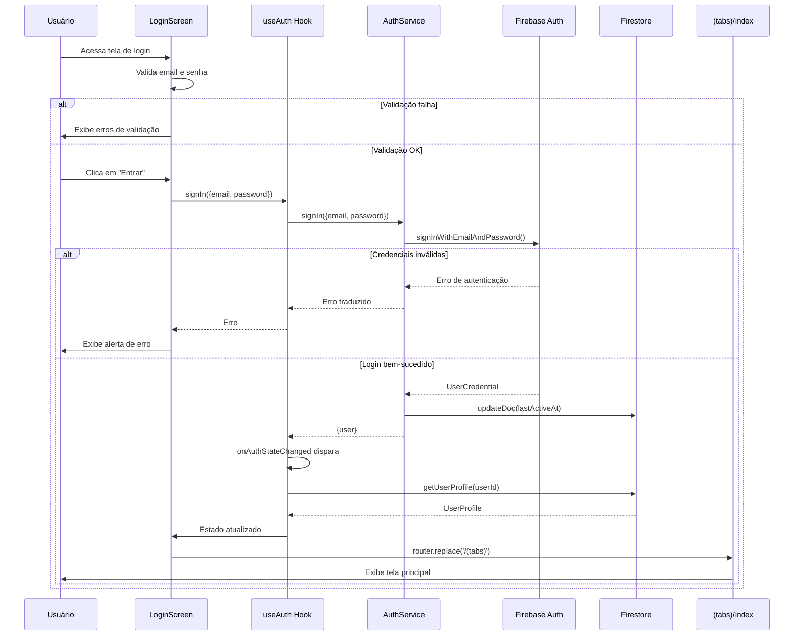
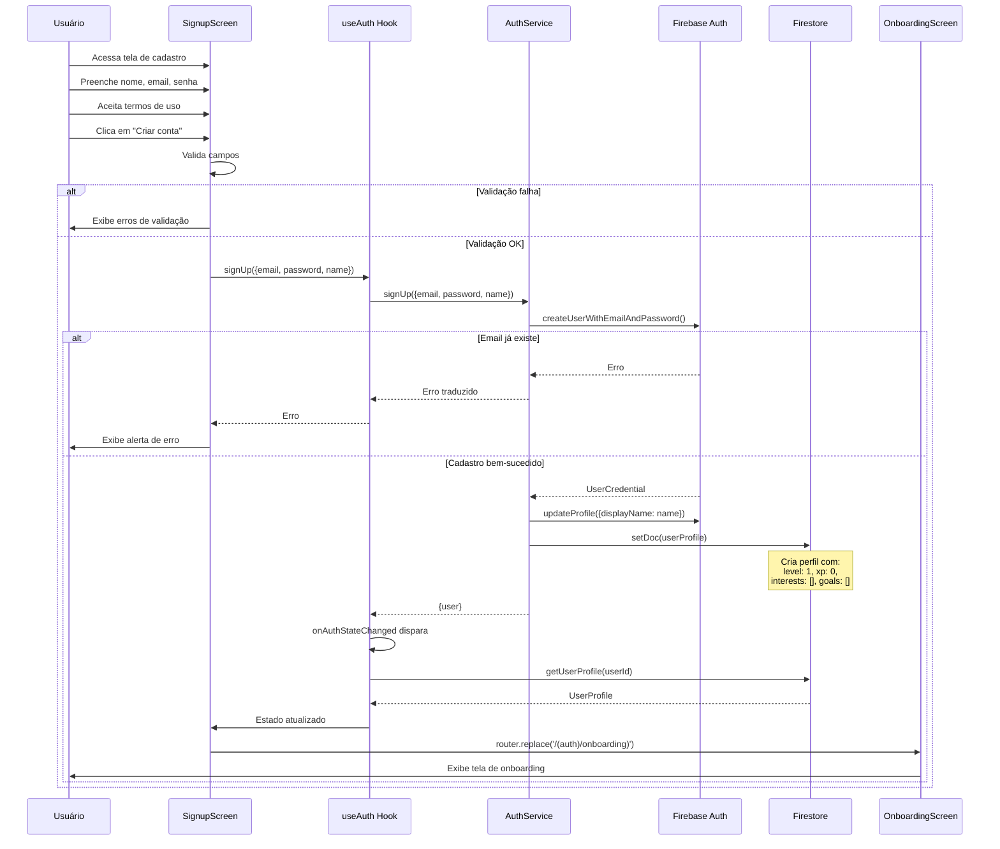
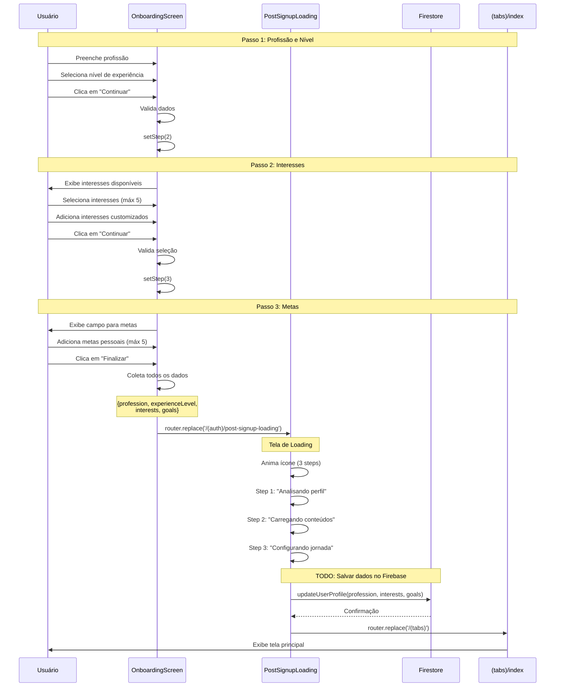
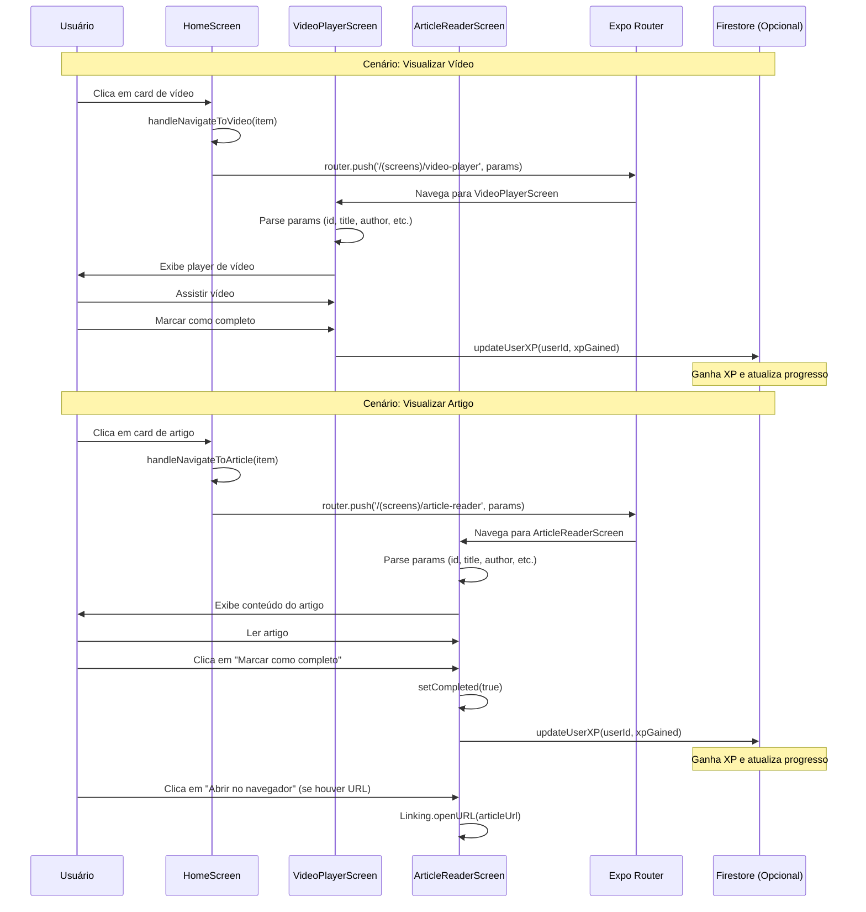
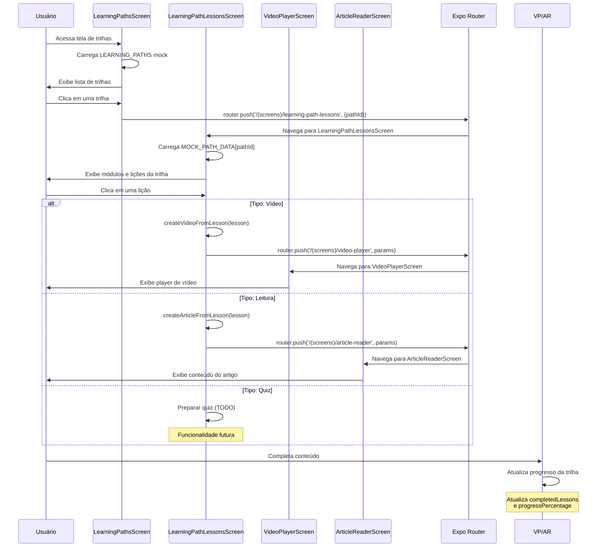
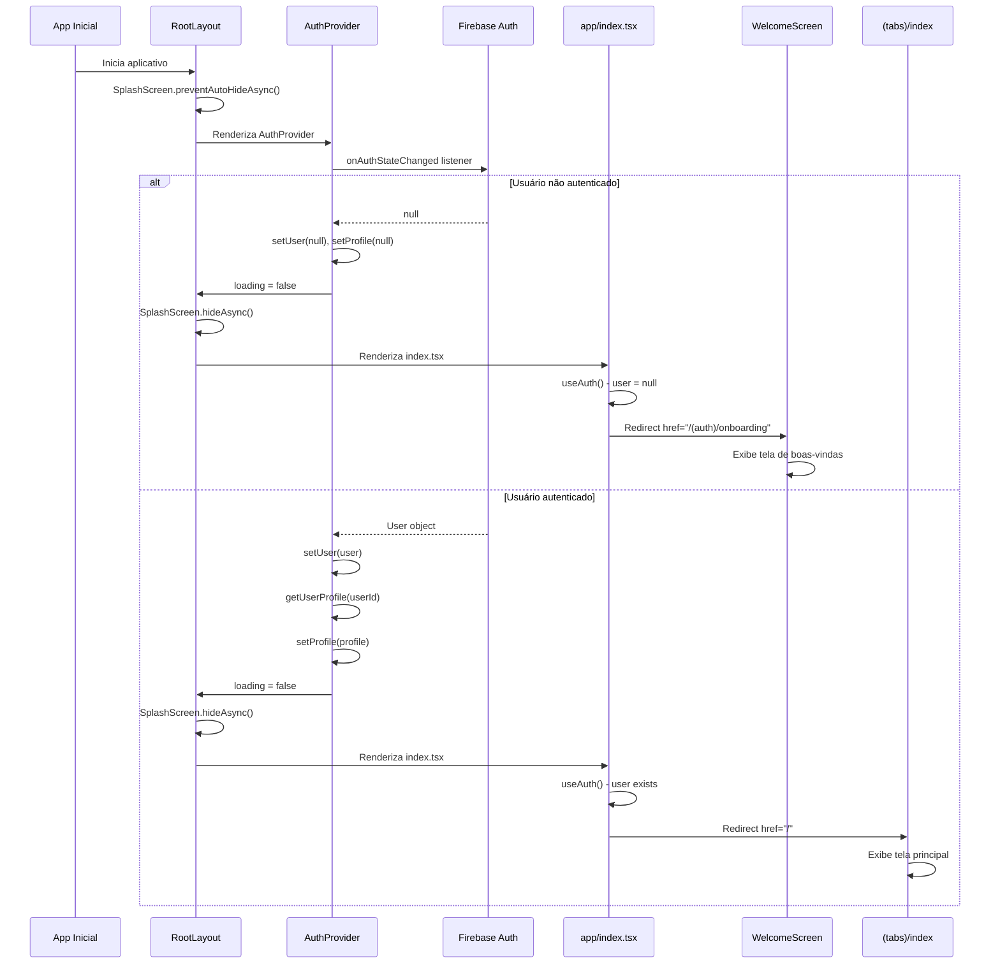
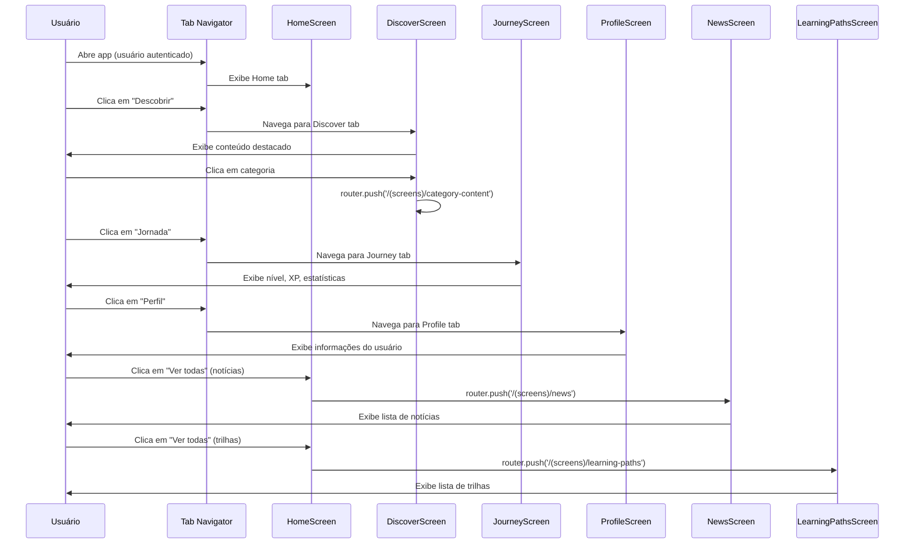
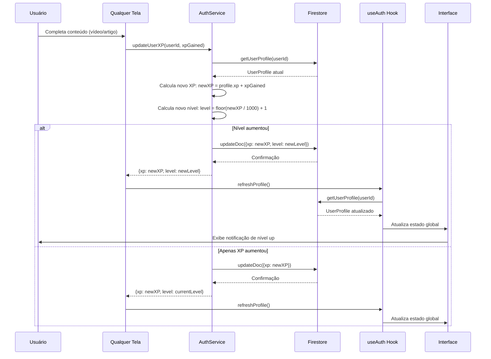
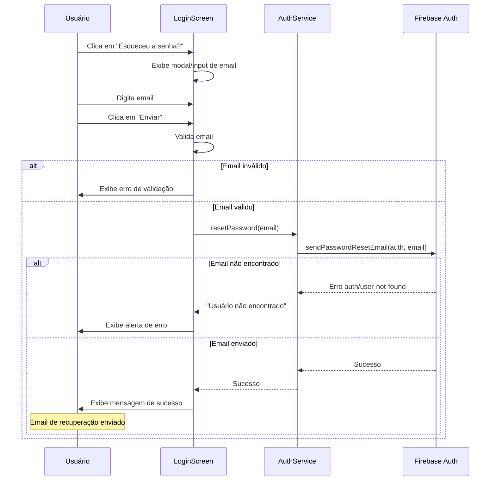
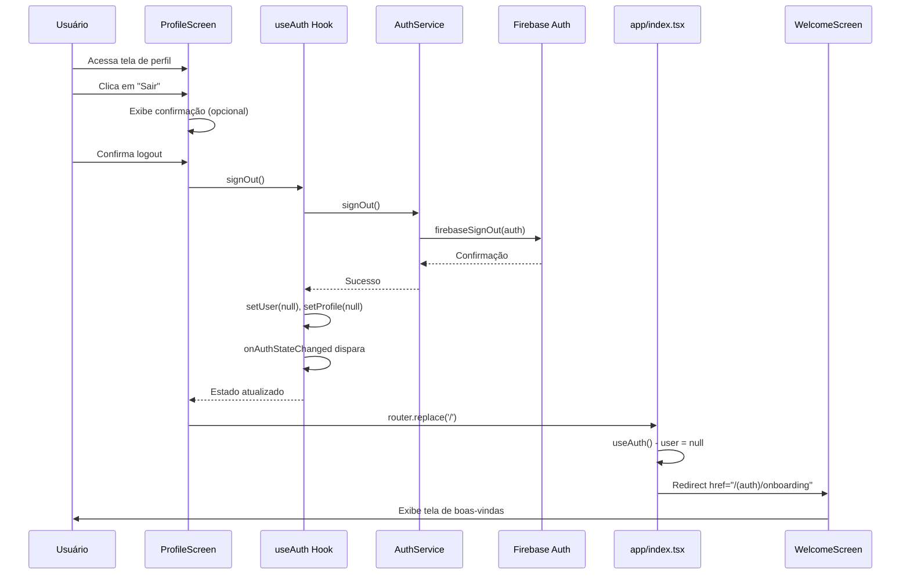

# Diagramas de Sequência - InFlow App

Este documento contém os diagramas de sequência dos principais fluxos do aplicativo InFlow.

## 1. Fluxo de Login

## 2. Fluxo de Signup (Cadastro)

## 3. Fluxo de Onboarding

## 4. Fluxo de Visualização de Conteúdo (Vídeo/Artigo)

## 5. Fluxo de Navegação em Trilhas de Aprendizado

## 6. Fluxo de Inicialização do App

## 7. Fluxo de Navegação entre Telas Principais

## 8. Fluxo de Atualização de XP e Nível

## 9. Fluxo de Recuperação de Senha

## 10. Fluxo de Logout

---

## Legenda

- **Participantes**: Componentes, telas, serviços e sistemas envolvidos no fluxo
- **Setas sólidas**: Chamadas diretas ou navegação
- **Setas tracejadas**: Respostas ou callbacks
- **Notas**: Informações adicionais sobre o processo
- **Alt/Else**: Condições e fluxos alternativos

## Observações Importantes

1. **Autenticação Persistente**: O Firebase Auth mantém a sessão do usuário automaticamente usando AsyncStorage no React Native.

2. **Estado Global**: O `useAuth` hook gerencia o estado de autenticação globalmente através do Context API.

3. **Navegação**: O app usa Expo Router para navegação baseada em arquivos.

4. **Firestore**: Os dados do usuário (perfil, XP, nível) são armazenados no Firestore.

5. **Mocks**: Atualmente, muitos dados são mockados (trilhas, conteúdos). A integração completa com Firebase está parcialmente implementada.

6. **TODOs Identificados**:
   - Salvar dados de onboarding no Firebase
   - Implementar sistema de quiz
   - Implementar tracking de progresso de trilhas
   - Implementar sistema de recomendações baseado em interesses

